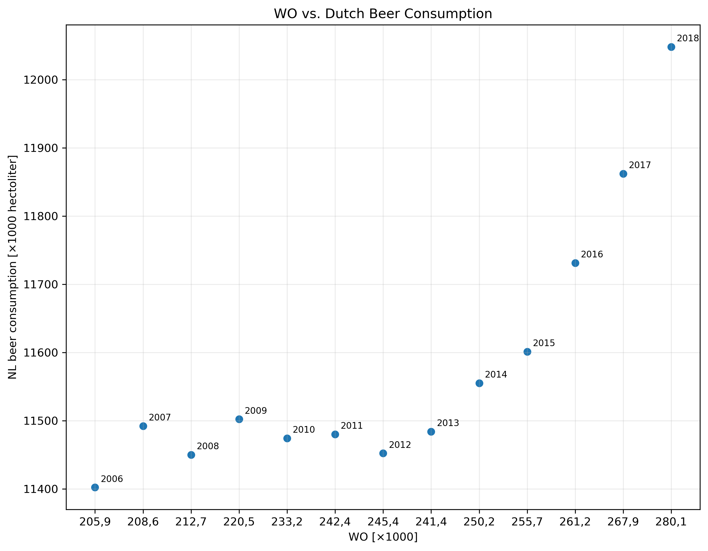

Name: Daniël Faas

StudentID: 14941384

The title of the following papers pivotal to our knowledge:

MCC Van Dyke et al., 2019:  The Rise of Coccidioides: Forces Against the Dust Devil Unleashed 

JT Harvey, Applied Ergonomics, 2002:  An analysis of the forces required to drag sheep over various surfaces

DW Ziegler et al., 2005: The neurocognitive effects of alcohol on adolescents and college students

The data shows the relationship between WO and Dutch beer consumption. While the WO consumption increases every year, the Dutch beer consumption remains fairly constant until 2013, after which the data shows a near linear relationship between WO and Dutch beer consumption.